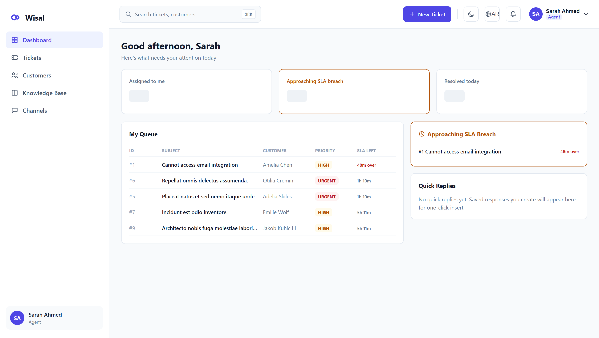
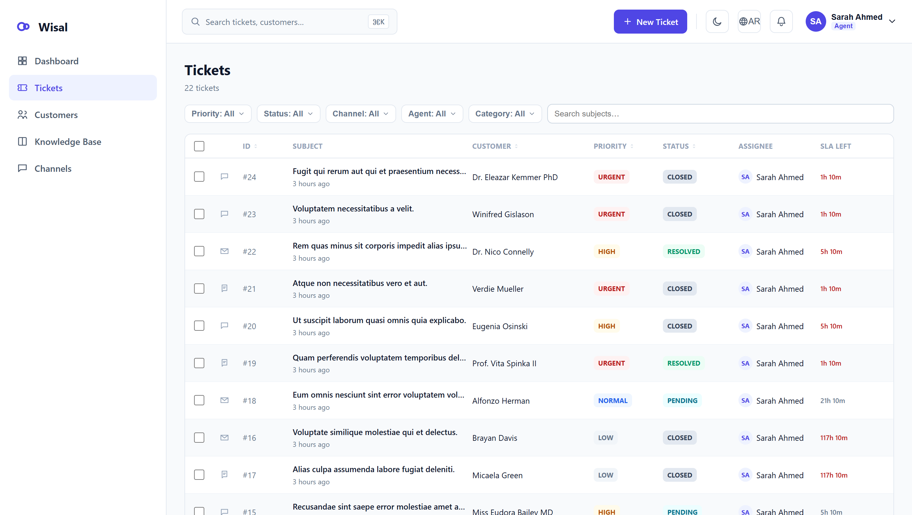
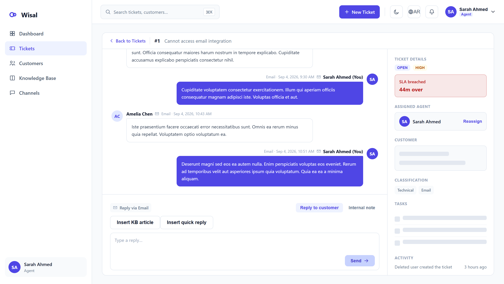
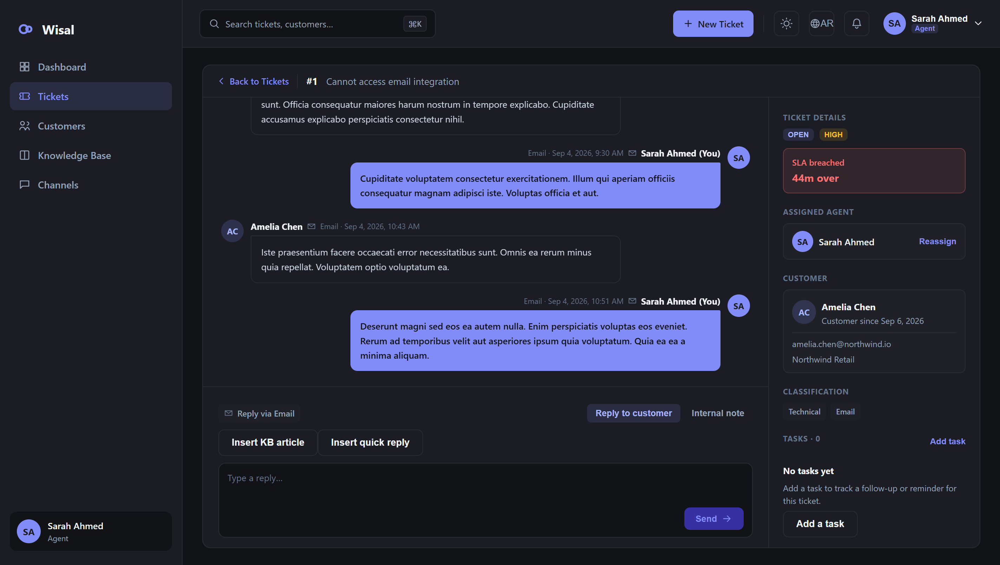
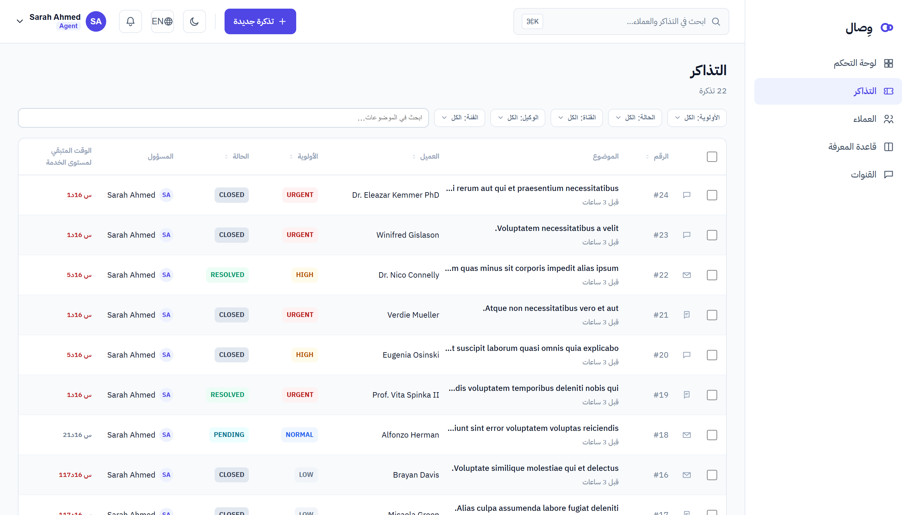
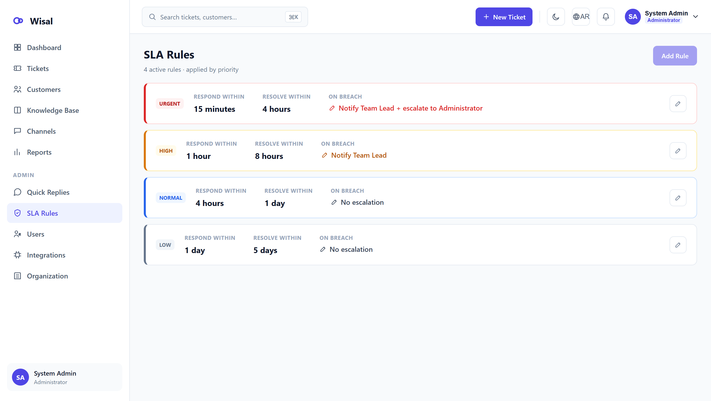
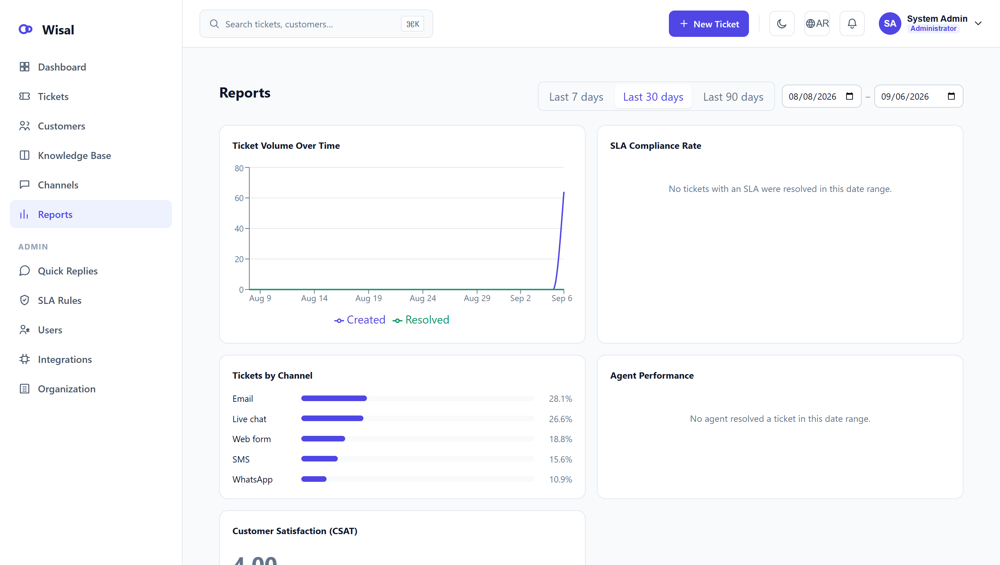
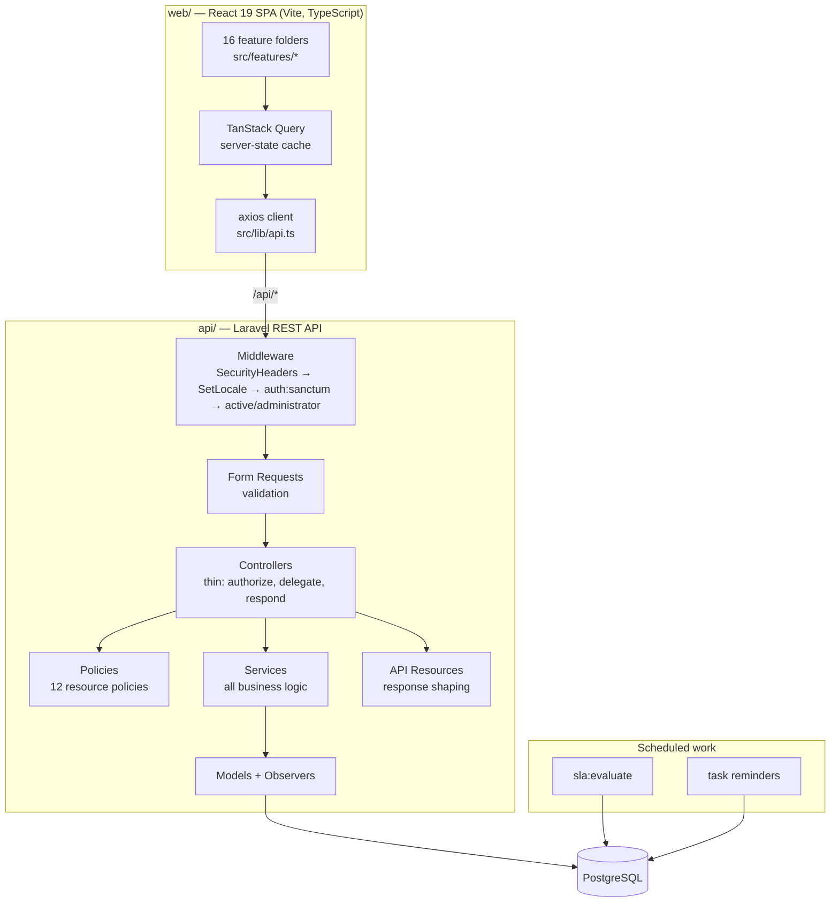
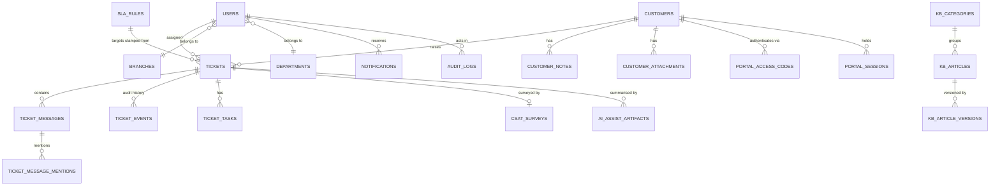
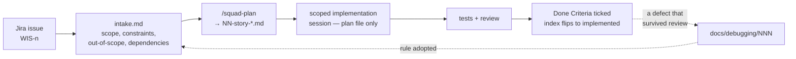

# Wisal (وِصال) — Customer Support CRM

A ticket-centric customer support platform: a Laravel REST API and a React SPA, built as a
monorepo. Agents work a prioritised queue, answer across channels from one thread, and are held
to SLA targets that a scheduled engine evaluates on its own. Team Leads see workload and
escalations; Administrators own users, roles, SLA policy, integrations and the organisation's
branches, departments and branding. Everything ships in Arabic and English, right-to-left and
left-to-right, light and dark.

**Live:** [k1-wisal.vercel.app](https://k1-wisal.vercel.app) — sign in as `agent@wisal.test`,
`lead@wisal.test` or `admin@wisal.test`, password `Password123!`, to see the three roles. Or run
it locally in [about a minute](#1-run-it-in-60-seconds).

This README is the project's documentation. It is written to be read start to finish: what the
system does, how it is built, why it is built that way, how it was planned and verified, and
where it is honestly incomplete. Every claim below points at the file that proves it.

---

## Contents

| Section | What you get |
|---|---|
| [Screens](#screens) | What it actually looks like — light, dark, Arabic RTL, admin |
| [1. Run it in 60 seconds](#1-run-it-in-60-seconds) | Clone → migrate → seed → login |
| [2. What was asked for, and what shipped](#2-what-was-asked-for-and-what-shipped) | The 12 requirement categories, each with a status and a reason, plus the assumptions taken |
| [3. Architecture](#3-architecture) | Layers, request lifecycle, error handling, the deliberate structural decisions |
| [4. Data model](#4-data-model) | ERD, the core tables, the invariants they encode |
| [5. API surface](#5-api-surface) | Every endpoint, grouped, with its guard |
| [6. Frontend](#6-frontend) | Feature folders, state, forms, i18n and RTL |
| [7. One feature, end to end](#7-one-feature-end-to-end) | A single click traced from the browser to the database and back |
| [8. Security and access control](#8-security-and-access-control) | Roles, policies, rate limits, audit trail |
| [9. Testing](#9-testing) | What is covered, what the edge-case tests actually assert |
| [10. How this was built](#10-how-this-was-built--spec-driven-ai-assisted) | The spec-driven loop, the plan anatomy, and how AI output was verified |
| [11. Working practice](#11-working-practice--git-conventions-review) | Git history, conventions, what keeps the code maintainable |
| [12. Known gaps](#12-known-gaps) | The unflattering list |
| [13. Deployment](#13-deployment) | Vercel, Supabase, the one cron line |
| [14. Repository map](#14-repository-map) | Where everything lives |
| [ملخص بالعربية](#ملخص-بالعربية) | Arabic summary |

---

## Screens

Captured from the running application against real seeded data — not mockups, and not the design
exports (those live in [docs/design/references/](docs/design/references)). Every screen below is
reachable in about a minute by following [section 1](#1-run-it-in-60-seconds).

**Agent — the role-based home.** Assigned volume, SLA risk and the working queue, in one view.



**The ticket queue.** Priority, status, assignee and time-left-on-SLA as columns, with faceted
filters and bulk actions.



**The conversation thread.** One multi-channel thread, the customer and SLA context beside it, and
a composer that can insert a knowledge-base article or a saved reply — and switch between a public
reply and an internal note.



**The same screen in dark mode.** Not a filter — a full token set; every surface, border and
status colour is defined twice.



**Arabic, right-to-left.** The layout mirrors, the navigation and table move to the right, and
server-sent status and priority labels come back in Arabic — the same screen, not a translated
copy of it.



**Administrator — SLA policy.** Response and resolution targets per priority, with the escalation
each breach triggers. Editing a rule applies to future tickets only.



**Administrator — reports.** Volume over time, SLA compliance, agent performance, channel mix and
CSAT over a selectable range. The panels with no data in range render an explicit empty state
rather than a zero.



---

## 1. Run it in 60 seconds

Requirements: PHP 8.3+, Node 20+, and PostgreSQL (or any engine Laravel supports — see
[the dual-engine note](#the-dual-engine-constraint)).

```bash
cd api && composer install && cp .env.example .env && php artisan key:generate
```

```bash
cd api && php artisan migrate --seed
```

```bash
cd api && php artisan serve --port=8000
```

```bash
cd web && npm install && npm run dev
```

The seeder ([api/database/seeders/DatabaseSeeder.php](api/database/seeders/DatabaseSeeder.php))
creates one account per role, all with the password `Password123!`:

| Email | Role | Use it to see |
|---|---|---|
| `agent@wisal.test` | Agent | The queue, the thread, quick replies, tasks |
| `lead@wisal.test` | Team Lead | Workload, escalations, reports |
| `admin@wisal.test` | Administrator | Users, SLA rules, integrations, organisation settings |
| `disabled@wisal.test` | Agent (deactivated) | The `active` middleware refusing a valid token |

The SLA engine is a scheduled command, not a queued job — nothing drains the `jobs` table in
this repository. Run it directly, or run the scheduler:

```bash
cd api && php artisan sla:evaluate
```

`--dry-run` reports without writing. `--backfill` stamps SLA targets on tickets created before
the SLA story landed, and is idempotent.

### Check this README against the code

Nothing here asks to be taken on trust. These five commands reproduce the claims that matter:

```bash
cd api && vendor/bin/pest                 # 500 tests, 2,345 assertions
```

```bash
cd web && npm run test                    # 546 tests across 83 files
```

```bash
cd web && npm run lint && npm run build   # oxlint + the no-hard-coded-strings check + tsc
```

```bash
git log --oneline                         # 41 commits — one story per commit
```

```bash
grep -c "Route::" api/routes/api.php      # the endpoint count behind section 5
```

Run the API suite without `--parallel` unless the local PostgreSQL user has `CREATEDB`; the
parallel runner creates a database per process.

---

## 2. What was asked for, and what shipped

The client's requirement capture is
[docs/requirements/client-requirements-raw.md](docs/requirements/client-requirements-raw.md) —
twelve categories. Nothing below is aspirational; a "partial" row says what is missing, and an
"out of scope" row says why the line was drawn there.

| # | Category | Status | Where it lives | Story |
|---|---|---|---|---|
| 1 | Customer Management | ✅ Done | `web/src/features/customers`, `api/app/Http/Controllers` + `CustomerPolicy` | WIS-4 |
| 2 | Ticket Management | ✅ Done | `web/src/features/tickets`, `api/app/Models/Ticket.php` | WIS-2 |
| 3 | Communication Channels | ⚠️ Partial | Every message carries a channel (`api/app/Enums/Channel.php`); `web/src/features/channels` is a read-only overview that states plainly that live ingestion is not in this release | WIS-15 |
| 4 | Agent Dashboard | ✅ Done | `web/src/features/agent-dashboard`, `api/app/Services/DashboardMetrics.php` | WIS-9 |
| 5 | SLA & Automation | ✅ Done | `api/app/Services/SlaClock.php`, `api/app/Console/Commands/EvaluateSlaCommand.php`, `TicketAssigner.php` | WIS-6 |
| 6 | Knowledge Base | ✅ Done | `web/src/features/knowledge-base`, `api/app/Services/Kb`, versioned articles | WIS-5 |
| 7 | AI Features | ⚠️ Partial | Ticket summary and suggested reply, `api/app/Services/Ai` + `web/src/features/ai-assist`. Auto-classification and a chatbot are not built | WIS-18 |
| 8 | Customer Portal | ✅ Done | `web/src/features/portal`, OTP access codes (`PortalAccess.php`), separate auth from staff | WIS-16 |
| 9 | Reports & Management | ✅ Done | `web/src/features/reports`, `api/app/Services/ReportAggregator.php` | WIS-7 |
| 10 | Security & Administration | ✅ Done | Roles, policies, append-only audit log, `web/src/features/users-roles-admin` | WIS-8 |
| 11 | Integrations | ⚠️ Partial by design | `web/src/features/integrations` — the admin surface to connect, configure, test and monitor. No live provider wiring; that is per-provider engineering | WIS-19 |
| 12 | Platform | ⚠️ Partial | Arabic/English + RTL shipped; branches, departments and custom branding shipped (`web/src/features/organization`). String extraction is incomplete — see [Known gaps](#12-known-gaps) | WIS-11, WIS-17, WIS-20 |

Twenty stories were specified, planned and implemented (WIS-1 … WIS-20). Their specifications
are in [.squad/stories/](.squad/stories) and their implementation plans in
[.squad/plans/](.squad/plans), indexed by [.squad/plans/00-index.md](.squad/plans/00-index.md).

### Assumptions taken where the requirement was silent

The requirement capture left real questions open. Each was answered deliberately, written into
the story that needed it, and is listed here so a reader can disagree with the answer rather
than guess at it.

| The requirement did not say | What was assumed, and why |
|---|---|
| How many roles, and what each may do | Three: Agent, Team Lead, Administrator. Two roles cannot express "sees the team but not the system"; four invents a distinction the client never described. Fixed in [ADR-004](docs/decisions/ADR-004-authentication.md) and used unchanged by every screen. |
| Whether customers log in the way staff do | No. External customers are a different audience with a different threat model, so the portal uses a one-time code and a separate session table, never a staff token — [ADR-005](docs/decisions/ADR-005-customer-portal-access.md). |
| What happens to an SLA target when an admin edits the rule | Existing tickets keep the target they were stamped with; the edit applies going forward. The alternative — recomputing history — would silently rewrite whether past tickets were breached. |
| Whether "multi-channel" means live inboxes | No. Every message is tagged with its channel and the data model supports ingestion, but wiring real providers is per-provider engineering and was scoped out openly rather than faked. |
| Working hours for SLA arithmetic | Elapsed wall-clock minutes, not a business-hours calendar — that needs holiday and timezone policy the client never supplied, and inventing one produces confidently wrong numbers. Time spent *pending on the customer* is excluded instead, via `sla_paused_at` / `sla_paused_minutes` ([SlaClock.php](api/app/Services/SlaClock.php)), which is the part an agent would actually dispute. |
| Which language is the default | Arabic and English are equal; the UI follows the user's stored preference, and the API localises server-sent labels from `Accept-Language`. Neither is hard-coded as primary. |
| Whether tickets can exist without a customer | No — enforced in the schema, not in a validator. A support ticket with no requester is not a support ticket. |

---

## 3. Architecture

A monorepo with two deployables and no shared runtime code — the contract between them is HTTP
and JSON only.



**Controllers stay thin.** They authorize, delegate and shape a response. Every rule that a
second caller could need lives in a service — 29 of them under
[api/app/Services/](api/app/Services). The clearest example is
[SlaClock.php](api/app/Services/SlaClock.php): every screen, widget, report and command reads
SLA risk through that one class, so "a rule edit applies going forward only" is a mechanism
rather than a convention, and a 25-row queue page costs zero extra queries to classify.

**Validation happens before a controller runs**, in Form Requests under
[api/app/Http/Requests/](api/app/Http/Requests). Authorization happens in
[policies](api/app/Policies) — twelve of them, one per resource — not in `if` statements
scattered through controllers.

**Why the SLA engine is a scheduled command, not a queued job.** A queue needs a worker process
that stays alive; the deployment target is serverless. A breach is also a function of elapsed
time, not of an event — nothing fires when a ticket *becomes* late. A periodic sweep over the
rows whose targets have passed is the honest model, and it is idempotent, so a missed or
duplicated run cannot corrupt state. See
[EvaluateSlaCommand.php](api/app/Console/Commands/EvaluateSlaCommand.php).

**Cross-cutting middleware** is registered in
[api/bootstrap/app.php](api/bootstrap/app.php): `SecurityHeaders` on every response, `SetLocale`
resolving `Accept-Language` so server-sent labels come back in the caller's language, then
`auth:sanctum` plus an `active` gate, plus an `administrator` gate on the admin route groups.

### Errors have one shape

Success is always `{ "data": … }`, shaped by an API Resource. Failure is never a stack trace and
never an ad-hoc string:

| Situation | Status | Body |
|---|---|---|
| Validation failed | `422` | Laravel's `{ message, errors: { field: [...] } }`, produced by the Form Request — the SPA maps `errors` straight onto the form fields |
| Not authenticated / token for a deactivated user | `401` | `{ message }` |
| Authenticated but not permitted | `403` | `{ message }` — from a policy, never from a hand-written check |
| Rate limited | `429` | `{ message }` + `Retry-After` |
| A domain rule refused | its own status | Domain exceptions carry their own rendering |

The domain exceptions are the interesting part, because each encodes a decision:
[`PortalCodeUnusableException`](api/app/Exceptions/PortalCodeUnusableException.php) renders the
same `410` for *missing, consumed, expired and attempt-exhausted*, so a caller cannot tell the
four apart and probe the code space;
[`AssistUnavailableException`](api/app/Exceptions/AssistUnavailableException.php) collapses every
AI-provider failure — timeout, rate limit, 5xx, refusal, empty completion, unconfigured — into one
`503`, so provider behaviour never leaks into the UI; and
[`AuditLogIsAppendOnly`](api/app/Exceptions/AuditLogIsAppendOnly.php) is a second layer behind a
route surface that already exposes no update or delete verb.

`bootstrap/app.php` forces JSON rendering for everything under `/api/*` and turns a tampered CSAT
signature into the same calm "expired" payload as an unknown one, so signed links stay
non-enumerable.

### The dual-engine constraint

Runtime is PostgreSQL (Supabase). Local test runs have moved between SQLite and a local
PostgreSQL instance over the project's life, for a reason documented in
[docs/debugging/002-pdo-sqlite-blocked.md](docs/debugging/002-pdo-sqlite-blocked.md): Windows
Application Control blocked the PHP PostgreSQL driver, then later the SQLite one. The lasting
consequence is a rule the codebase still follows: **every migration and every raw expression must
be valid on both engines.** No PostgreSQL-only column types, no `ILIKE` in shared queries, no
engine-specific JSON operators outside a guarded branch.

---

## 4. Data model

39 migrations under [api/database/migrations/](api/database/migrations), 23 Eloquent models.
The core:



Four invariants worth knowing, each enforced in the schema rather than in application code:

- **`tickets.customer_id` is required.** A ticket with no customer is not a support ticket.
  Enforced by [`require_tickets_customer_id`](api/database/migrations/2026_08_27_120100_require_tickets_customer_id.php).
- **`audit_logs` is append-only** — no update, no delete path. See
  [`make_audit_logs_append_only`](api/database/migrations/2026_08_28_090200_make_audit_logs_append_only.php).
- **SLA targets are stamped onto the ticket row**, not read back through a rule at display time
  ([`add_sla_columns_to_tickets_table`](api/database/migrations/2026_08_27_130100_add_sla_columns_to_tickets_table.php)).
  That is what makes an SLA rule edit apply to future tickets only.
- **A message carries a visibility**, so an internal note can never leak into a customer-visible
  thread ([`add_visibility_to_ticket_messages_table`](api/database/migrations/2026_08_28_140000_add_visibility_to_ticket_messages_table.php),
  enum in [MessageVisibility.php](api/app/Enums/MessageVisibility.php)).

### Where the query cost was actually thought about

- **Indexes were added for named access patterns, not sprinkled.** The reporting aggregations get
  `created_at`, `resolved_at` and a composite `(assigned_to, resolved_at)`
  ([migration](api/database/migrations/2026_08_28_150000_add_reporting_indexes_to_tickets_table.php));
  the audit-log viewer gets indexes matching its actual filter combinations, with the measured
  before/after written into the migration's docblock
  ([migration](api/database/migrations/2026_08_28_090300_add_audit_log_viewer_indexes.php)).
- **The queue page classifies SLA risk with zero extra queries.** `SlaClock::snapshot()` reads
  only columns already on the loaded ticket row — a per-row rule lookup would have cost 25
  queries on a 25-row page.
- **Knowledge-base search is real full-text search on PostgreSQL** — a `tsvector` column, a GIN
  index and a trigger that keeps it current, with `setweight(title,'A') || setweight(body,'B')`
  so a title match outranks a body-only match. The migration is guarded on the driver and is a
  no-op elsewhere, where `App\Services\Kb\LikeArticleSearch` takes over — which is the
  dual-engine rule applied rather than merely stated
  ([migration](api/database/migrations/2026_08_28_100300_add_search_vector_to_kb_articles.php)).

Domain vocabulary is typed as PHP enums, never as loose strings —
[api/app/Enums/](api/app/Enums), fourteen of them:

| Enum | Values |
|---|---|
| `UserRole` | `agent`, `team_lead`, `administrator` |
| `TicketStatus` | `open`, `pending`, `resolved`, `closed` |
| `Priority` | `low`, `normal`, `high`, `urgent` |
| `Channel` | `email`, `whatsapp`, `chat`, `sms`, `web_form` |
| `MessageVisibility` | public / internal note |
| plus | `ArticleStatus`, `AssistKind`, `CsatSurveyState`, `CustomerTier`, `IntegrationStatus`, `IntegrationType`, `NotificationType`, `QuickReplyStatus`, `TaskStatus` |

---

## 5. API surface

All routes are declared in [api/routes/api.php](api/routes/api.php) (334 lines, grouped by
guard rather than by controller so the protection on any endpoint is readable at a glance).

**Public** — no token:

| Method | Path | Guard |
|---|---|---|
| `POST` | `/api/login` | `throttle:login` — 5/min per email+IP, 20/min per IP |
| `GET`/`POST` | `/api/csat/{uuid}` | `signed` + `throttle:csat` |
| `POST` | `/api/portal/access/request` · `/verify` | separate portal limiters |
| `GET` | `/api/portal/faq` · `/faq/{slug}` | `throttle:portal-access` |

**Staff** — `auth:sanctum` + `active`:

| Area | Endpoints |
|---|---|
| Session | `GET /user`, `PATCH /user/preferences`, `POST /logout` |
| Tickets | `GET /tickets`, `/tickets/meta`, `POST /tickets`, `POST /tickets/bulk`, `GET`/`PATCH /tickets/{ticket}`, `GET /tickets/{ticket}/events` |
| Thread | `GET`/`POST /tickets/{ticket}/messages`, `GET /tickets/{ticket}/mentionable-users` |
| AI assist | `GET /tickets/{ticket}/ai-assist`, `POST …/summary`, `POST …/reply`, `DELETE …/reply` — `throttle:ai-assist` |
| Customers | `apiResource customers`, `/customers/facets`, `/customers/bulk`, `/{customer}/tickets`, `/notes`, `/attachments` |
| Productivity | `/quick-replies` (+ `/archive`), `/tickets/{ticket}/tasks`, `/tasks`, `/tasks/{task}/complete` |
| Dashboards | `/agent/summary` · `/queue` · `/sla-risk`, `/team/summary` · `/workload` · `/escalations`, `/admin/summary` |
| Reports | `/reports/summary`, `/channels/overview` |
| Knowledge base | `/kb/articles` (+ publish / unpublish / archive / bulk), `/kb/categories`, `/kb/search`, `/kb/preview` |
| Notifications | `/notifications`, `/unread-count`, `/read-all`, `/{notification}/read` |
| Branding | `/organization/branding` |

**Administrator only** — the routes above plus the `administrator` middleware:

| Area | Endpoints |
|---|---|
| Users | `GET`/`POST /users`, `GET`/`PATCH /users/{user}`, `/deactivate`, `/activate`, `/users/facets` |
| SLA policy | `GET`/`POST /sla-rules`, `PATCH`/`DELETE /sla-rules/{rule}` |
| Audit | `GET /audit-logs`, `/audit-logs/facets` |
| Settings | `GET`/`PATCH /settings` |
| Integrations | `GET /integrations`, `PUT`/`DELETE /integrations/{type}`, `POST /integrations/{type}/test` |
| Organisation | `/branches`, `/departments`, `/branding` (+ logo upload / delete) |

Response shaping is done by API Resources
([api/app/Http/Resources/](api/app/Http/Resources)), never by returning a model directly — that
is what keeps a masked integration secret masked, and an internal note out of a portal payload.
The response contract is locked by
[api/tests/Feature/ApiContractTest.php](api/tests/Feature/ApiContractTest.php).

---

## 6. Frontend

React 19 + TypeScript on Vite. Dependencies are deliberately few: TanStack Query for server
state, React Hook Form + Zod for forms, react-i18next for language, React Router for routing,
Recharts for the report charts, axios for transport.

```
web/src/
├── app/           the shell every screen renders inside — layout, navigation, providers
├── components/    shared primitives used by more than one feature
├── features/      16 folders, one per product area, each self-contained
├── i18n/          config + ar/ and en/ namespace JSON
├── lib/           api.ts (axios instance) and queryClient.ts
└── test/          setup and shared test utilities
```

**No global client-state store.** Server data lives in TanStack Query, which owns caching,
invalidation and refetching. The only React contexts are the ones holding genuinely global UI
state — `UiPreferencesContext` (theme, language) and `BrandingProvider` (the organisation's
colours and logo). Anything else is local component state, on purpose.

**Navigation is role-aware at the source.**
[web/src/app/navigation/navItems.tsx](web/src/app/navigation/navItems.tsx) declares the roles
allowed to see each item, so an Agent is never shown a link they would be refused at. The
server enforces the same rule independently — the nav config is UX, not security.

**Every screen ships three states.** Loading, empty and error are required, not optional, and
are reviewed as part of the design brief
([docs/design/brief.md](docs/design/brief.md)). The design system — tokens, priority and status
colours, typography, the full RTL mirroring rules, light and dark — is that document, with every
screen exported under [docs/design/references/](docs/design/references) in four variants
(light/dark × LTR/RTL).

**Arabic is a first-class direction, not a stylesheet flip.** Layout mirrors, icons that imply
direction mirror, numerals and dates localise, and the language switch is instant. A lint rule
enforces it: `npm run lint` runs
[web/scripts/check-no-literals.mjs](web/scripts/check-no-literals.mjs), which fails the build on
a hard-coded user-facing string inside any enforced root. The enforced roots and every
deliberate exception (with its reason) are in
[web/scripts/i18n-allowlist.json](web/scripts/i18n-allowlist.json). That list is also an honest
record of what is *not* yet enforced — see [Known gaps](#12-known-gaps).

---

## 7. One feature, end to end

One click — an agent sends a reply on a ticket, mentioning a colleague — traced through every
layer, because a feature list says nothing about whether the layers actually join up.

```mermaid
sequenceDiagram
    participant A as Agent (browser)
    participant H as useSendReply (TanStack mutation)
    participant R as POST /api/tickets/{id}/messages
    participant V as StoreTicketMessageRequest
    participant P as TicketPolicy
    participant S as MentionResolver
    participant D as Database (one transaction)
    participant N as NotificationDispatcher

    A->>H: submit the composer
    H->>R: axios POST { body, visibility, mentions[] }
    R->>V: validate + authorize
    V->>P: TicketPolicy@view / reply
    R->>S: resolve mentions BEFORE any insert
    R->>D: BEGIN
    D-->>D: ticket_messages row (channel from the ticket, never the client)
    D-->>D: ticket touched — last activity moves
    D-->>D: ticket_events: replied / internal_note_added
    D-->>D: mention pivot rows + one "mentioned" event each
    D-->>D: customer.last_contact_at — only if the message is public
    R->>D: COMMIT
    R->>N: dispatch mention notifications (after commit)
    R-->>H: 201 { data: TicketMessageResource }
    H->>H: invalidate thread, ticket, queue and event caches
    H-->>A: the reply appears; the queue row's activity updates
```

Five decisions in that path are worth naming, because each one is a bug that did not happen:

1. **The channel is taken from the ticket, never from the request body.** A client cannot forge
   the channel a message arrived on.
2. **Mentions resolve before the insert, inside the same transaction.** A mention of a user the
   author is not allowed to see aborts the whole thing — it can never leave a half-written
   message row behind. Asserted by `MentionAuthorizationTest.php`.
3. **Notifications dispatch after commit, not inside it.** A "you were mentioned" alert for a
   message that failed to persist is a lie the user cannot check.
4. **`customer.last_contact_at` advances only for a customer-visible message.** An internal note
   is not customer contact, so it must not make the customer look recently served.
5. **The response is an API Resource, not a model.** Which is why an internal note never leaks
   into a payload that a portal session can read.

The same shape holds everywhere else: validate in a Form Request, authorize in a policy, do the
work in a service or one transaction, shape the response in a Resource, invalidate precisely on
the client.

---

## 8. Security and access control

**Authentication.** Laravel Sanctum tokens for staff. The Customer Portal deliberately does
*not* reuse it: external customers authenticate with a one-time access code and a separate
session table, resolved by its own [`PortalAuth`](api/app/Http/Middleware/PortalAuth.php)
middleware, never `auth:sanctum`. The reasoning — including why an OTP rather than a magic link
— is [ADR-005](docs/decisions/ADR-005-customer-portal-access.md). Staff auth is
[ADR-004](docs/decisions/ADR-004-authentication.md).

**Authorization** is three layers, and each is independent:

1. Route-group middleware — `active` on everything authenticated, `administrator` on the admin
   groups.
2. Policies — twelve, one per resource, in [api/app/Policies/](api/app/Policies).
3. Query scoping — an Agent's list endpoints are scoped, not filtered client-side. Asserted by
   [TicketScopeTest.php](api/tests/Feature/TicketScopeTest.php) and
   [NotificationScopeTest.php](api/tests/Feature/NotificationScopeTest.php).

**Roles.**

| Capability | Agent | Team Lead | Administrator |
|---|:--:|:--:|:--:|
| Work the ticket queue, reply, take notes | ✅ | ✅ | ✅ |
| See other agents' workload and escalations | — | ✅ | ✅ |
| Reports | — | ✅ | ✅ |
| Manage quick replies | — | ✅ | ✅ |
| Users, roles, activation | — | — | ✅ |
| SLA rules, integrations, organisation settings, audit log | — | — | ✅ |

**Rate limiting is per-surface, never shared** — declared in
[api/bootstrap/app.php](api/bootstrap/app.php) with the reasoning inline. Six separate limiters:
`login`, `csat`, `portal-access`, `portal-verify`, `portal`, `ai-assist`. They are separate on
purpose: a flood of public CSAT traffic must not lock out agents, and an agent looping the AI
regenerate button behind an office NAT must not lock out the floor — so `ai-assist` is keyed on
the user id, at 6/minute and 200/day.

**Other measures.** `SecurityHeaders` on every response. Integration secrets encrypted at rest
and masked in every API response, including on the configure view of an already-connected
integration. An append-only audit log with its own viewer. A tampered CSAT signature renders the
same calm "expired" state as an unknown one, so the link space cannot be enumerated — the
handler is in [bootstrap/app.php](api/bootstrap/app.php) and the behaviour is under test.

---

## 9. Testing

Two suites, both green on the commit this README landed on:

| Suite | Files | Tests | Assertions | Run |
|---|---|---|---|---|
| API (Pest) | 109 | **500 passed** | 2,345 | `cd api && vendor/bin/pest` |
| Web (Vitest) | 83 | **546 passed** | — | `cd web && npm run test` |

`npm run lint` (oxlint + the i18n literal check) and `npm run build` are clean.

```bash
cd api && vendor/bin/pest
```

```bash
cd web && npm run test
```

```bash
cd web && npm run lint && npm run build
```

Coverage is not spread evenly on purpose — it is concentrated on the places where a wrong answer
is expensive, and most of those tests exist because an edge case was reasoned about before the
code was written:

| What is asserted | Test |
|---|---|
| The response envelope of every endpoint stays stable | `api/tests/Feature/ApiContractTest.php` |
| An agent cannot see another agent's tickets, at the query level | `TicketScopeTest.php` |
| An internal note never reaches a customer-visible payload | `InternalNoteVisibilityTest.php` |
| You cannot mention a user you are not allowed to see | `MentionAuthorizationTest.php` |
| The same SLA event never fires two notifications | `NotificationIdempotencyTest.php` |
| Closing a ticket cancels its open tasks | `TicketCloseCancelsTasksTest.php` |
| A report over a range with no data returns a well-formed empty result, not a crash | `ReportEmptyDataTest.php` |
| A duplicate customer is detected rather than silently created twice | `CustomerDuplicateTest.php` |
| Portal code exhaustion returns 410, and is not confused with a 429 | `api/tests/Feature/Portal/` |
| Arabic locale resolution on server-sent labels | `api/tests/Feature/I18n/` |

On the frontend, tests sit next to the component they cover (`AppLayout.test.tsx`,
`navItems.test.ts`, `BrandingProvider.test.tsx`, …), which is why the count is high relative to
the size of the app: the shell, navigation gating, RTL layout and provider behaviour are each
pinned independently.

---

## 10. How this was built — spec-driven, AI-assisted

This project was built with AI assistance under a fixed process, and the process left artefacts
behind on purpose. They are in the repository, not in a chat log.



**Specification before implementation.** Each story starts as a Jira issue and becomes an
`intake.md` — scope, explicit constraints, out-of-scope, dependencies, design reference. Twenty
of them: [.squad/stories/](.squad/stories). The out-of-scope section is the load-bearing part;
it is why "Customer Portal login" appears as a deferral in five earlier stories before becoming
WIS-16, rather than being quietly bolted onto staff auth.

**Planning before code.** The intake is turned into a plan under
[.squad/plans/](.squad/plans) — owned tables, enums and endpoints, cross-story contracts, edge
cases, a test plan and done criteria. Plans are written at one of two depths, and the index
records which: `full` (verified file paths and line ranges, implement straight from it) or
`contract` (scope and contracts final, file paths deliberately absent because the code they
build on does not exist yet — inventing line numbers would be a lie). See
[.squad/plans/00-index.md](.squad/plans/00-index.md).

**What a plan actually contains.** Not a to-do list — a document another engineer could
implement from without asking a question. Roughly 17,800 lines of them are in this repository.
[The SLA plan](.squad/plans/sla-rules-automation/06-story-sla-rules-automation.md) is
representative, at ~1,500 lines:

| Plan section | What it pins down |
|---|---|
| Prerequisites · Context — read these files first | The exact existing files to read before touching anything |
| Story goal | One paragraph; the thing that is true when this is done |
| Product rules — where this plan resolves a conflict | Every place the requirement contradicted itself or an earlier story, and the ruling |
| Backend tasks 1–10 | One numbered task per unit of work: the table and model, the eleven ticket columns, `SlaClock`, auto-assignment takeover from an earlier story, the engine command, the notifier seam, the resource block, requests/policy/controller/routes, the seeder |
| Frontend tasks 11–14 | Tokens, the feature folder and route, the schema and formatter, the page and its components |
| Edge cases & failure modes | Enumerated before implementation, each with the expected behaviour |
| Migration / rollback | How to undo it |
| Test plan | The Pest and Vitest tests to write, named, per task |
| Verification steps | The commands to run to prove it works |
| Shared contracts this story establishes | The tables, columns and payload blocks later stories may depend on |
| Done criteria | Checkboxes; the index flips to `implemented` only when all are ticked |

**Build order came from the dependency graph, not from enthusiasm.** Authentication first
because everything sits behind it, then the app shell every screen renders inside, then i18n —
deliberately early, because retrofitting translation means reopening every component (and the one
part deferred anyway became the project's biggest debt, see [Known gaps](#12-known-gaps)). Then
the ticket entity, then everything that reads it: the thread, customers, the SLA engine, and only
then the dashboards and reports that aggregate all of it. The full ordering and each story's
dependencies are in [.squad/plans/00-index.md](.squad/plans/00-index.md).

**Implementation in a scoped session.** A fresh session gets the plan file and nothing else, so
the model cannot drift into unrelated code.

**Verification, and what it caught.** The interesting artefact is
[docs/debugging/](docs/debugging) — ten write-ups of real defects, each one *what happened → why
→ how it was fixed*, and several of them are cases where a plausible-looking generated solution
was wrong and was caught by testing rather than by reading:

- [003](docs/debugging/003-vercel-bootstrap-cache.md), [004](docs/debugging/004-vercel-api-origin.md),
  [005](docs/debugging/005-vercel-script-name.md) — three separate serverless deployment failures,
  each one invisible locally.
- [006](docs/debugging/006-claude-design-defects.md) — a recurring defect class in generated
  markup: a CSS class referenced in the HTML with no rule defined for it (focus-visible and
  skeleton styles). The response was a rule: grep for it before trusting any new export.
- [008](docs/debugging/008-sla-seed-mismatch.md) — SLA dashboards rendering dashes instead of
  numbers because seeded data and engine expectations had drifted apart.
- [002](docs/debugging/002-pdo-sqlite-blocked.md) — the environment problem that produced the
  dual-engine rule the whole schema now follows.

**Decisions are recorded, not remembered.** [docs/decisions/](docs/decisions) holds the ADRs.
Where a decision departs from an earlier one, the newer ADR says so and explains why — ADR-005
deliberately breaks with ADR-004's model for a different audience.

---

## 11. Working practice — Git, conventions, review

**One story, one commit.** The history reads as the delivery log: 41 commits, Conventional
Commits with the feature slug as the scope, and the story id in the subject where it applies.

```
feat(sla): SLA rules engine and ticket due-date automation
feat(agent-productivity): quick replies, ticket tasks and mentions
feat(i18n): extract src/components strings into common namespace (WIS-17 Task 2)
fix(api): redirect bootstrap cache to /tmp so Vercel rebuilds it
docs(plans): mark delivered stories as implemented
```

`git log --oneline` is a readable list of what shipped, in order. A `fix(...)` commit
corresponds to a write-up in [docs/debugging/](docs/debugging) — the two are meant to be read
together.

**What keeps the code maintainable**, concretely rather than as an adjective:

- **One place per rule.** If two callers need a behaviour, it is a service. `SlaClock` is the
  strict version of this: no controller, resource, command or test recomputes an SLA threshold.
- **Types instead of strings.** Fourteen PHP enums for the domain vocabulary; on the client,
  TypeScript with `noUnusedLocals`, `noUnusedParameters` and `noFallthroughCasesInSwitch`
  enforced at build time ([web/tsconfig.app.json](web/tsconfig.app.json)), and Zod schemas on the
  forms so the runtime shape and the compile-time type cannot drift.
- **The compiler and the linter are part of the build.** `npm run build` runs `tsc -b` first, and
  `npm run lint` runs oxlint plus the i18n literal check — a hard-coded user-facing string fails
  the build rather than being caught in review.
- **Comments explain decisions, not syntax.** The docblocks worth reading are the ones stating
  why a design was chosen and what it buys — see the header of
  [SlaClock.php](api/app/Services/SlaClock.php) or the rate-limiter block in
  [bootstrap/app.php](api/bootstrap/app.php).
- **Tests are the review gate.** A story is not done while its plan's test list is unwritten;
  the Done Criteria checkboxes are what flip the plan index to `implemented`.

---

## 12. Known gaps

Stated plainly, because a reviewer will find them anyway and because pretending otherwise is
worse than the gap.

- **The i18n retrofit is incomplete.** Both locale catalogues exist and every server-sent label
  is localised, but the lint rule that forbids hard-coded strings is only enforced on ten roots.
  Nine feature folders — `customers`, `knowledge-base`, `notifications`, `reports`,
  `users-roles-admin`, `agent-dashboard`, `agent-productivity`, `channels`, `csat` — still hold
  English literals and will render English inside the Arabic UI. Tracked as WIS-17, current
  state in [web/scripts/i18n-allowlist.json](web/scripts/i18n-allowlist.json) and
  [docs/debugging/009-i18n-retrofit-gap.md](docs/debugging/009-i18n-retrofit-gap.md).
- **Some plans are still at `contract` depth.** The index marks them. They are implemented, but
  the plan file was never regenerated at full depth afterwards.
- **Integrations are a configuration surface only.** Connect, configure, test and monitor —
  no live ERP field mapping, no real WhatsApp/SMS/Email send-and-receive. This is a stated
  scope boundary (WIS-19), not an oversight.
- **AI features are partial.** Summary and suggested reply are built; auto-classification and a
  customer-facing chatbot are not.
- **Channels are read-only.** Every message is tagged with its channel and the overview screen
  reports honestly that live ingestion is not in this release.
- **Test execution is environment-sensitive.** Windows Application Control has blocked PHP
  database drivers on this machine more than once; `api/phpunit.xml` currently targets a local
  PostgreSQL database. Running the API suite with `--parallel` needs a database user with
  `CREATEDB`.

---

## 13. Deployment

Two Vercel projects, one PostgreSQL database on Supabase.

- **API** — [api/vercel.json](api/vercel.json) runs the Laravel app as a PHP function, with
  every path routed to `api/index.php`.
- **Web** — [web/vercel.json](web/vercel.json) builds the SPA and rewrites `/api/*` to the API
  deployment, so the browser only ever talks to one origin. The SPA fallback rewrite keeps
  client-side routes working on refresh.
- **Environment** — the API needs the standard Laravel keys plus the database credentials; the
  SPA needs `VITE_API_URL` (defaulting to `http://localhost:8000/api`, see
  [web/src/lib/api.ts](web/src/lib/api.ts)). No secret is committed to this repository.
- **Scheduled work** — one cron line is the whole story:

  ```
  * * * * * php artisan schedule:run
  ```

**Both environments are live**, verified on 2026-09-06: the SPA serves at
[k1-wisal.vercel.app](https://k1-wisal.vercel.app) and its `/api/*` rewrite reaches the API
deployment — an unauthenticated `GET /api/user` answers `401` and a seeded login answers `200`
with a token. (An older `wisal-crm-web.vercel.app` URL is dead and should not be used.)

Three deployment failures are already documented rather than rediscovered: bootstrap cache,
API origin mismatch, and script-name routing —
[docs/debugging/003](docs/debugging/003-vercel-bootstrap-cache.md),
[004](docs/debugging/004-vercel-api-origin.md), [005](docs/debugging/005-vercel-script-name.md).

---

## 14. Repository map

```
.
├── api/                    Laravel REST API
│   ├── app/
│   │   ├── Console/Commands/   sla:evaluate, task reminders
│   │   ├── Enums/              14 typed domain vocabularies
│   │   ├── Http/               Controllers, Requests, Resources, Middleware
│   │   ├── Models/             23 Eloquent models
│   │   ├── Observers/          ticket resolution side effects
│   │   ├── Policies/           12 resource policies
│   │   └── Services/           29 service classes — all business logic
│   ├── database/migrations/    39 migrations
│   ├── routes/api.php          every endpoint, grouped by guard
│   └── tests/                  Pest suite
├── web/                    React 19 SPA
│   ├── src/app/                shell, navigation, providers
│   ├── src/features/           16 product areas
│   ├── src/i18n/               ar/ + en/ namespaces
│   └── scripts/                the no-hard-coded-strings lint rule
├── docs/
│   ├── requirements/           what the client asked for
│   ├── design/                 the design system + every screen, 4 variants each
│   ├── decisions/              ADRs
│   └── debugging/              10 defect write-ups (Arabic)
├── .squad/
│   ├── stories/                20 specifications
│   └── plans/                  20 implementation plans + index
└── STATUS.md                   one-page current state
```

---

## ملخص بالعربية

**وِصال** نظام دعم عملاء متمركز حول التذكرة: واجهة برمجية بـ Laravel وواجهة مستخدم بـ React،
في مستودع واحد. الموظف يشتغل على طابور تذاكر مرتّب بالأولوية، ويرد على العميل من خيط محادثة
واحد يجمع كل القنوات، وملتزم بأهداف SLA يقيسها محرّك مجدوَل بنفسه. قائد الفريق يرى توزيع
الحِمل والتصعيدات، والمدير يملك المستخدمين والصلاحيات وسياسة الـSLA والتكاملات وفروع المنظمة
وأقسامها وهويتها البصرية. كل شيء يعمل بالعربية والإنجليزية، يمين-لليسار ويسار-لليمين، في الوضع
الفاتح والداكن.

**كيف بُني.** كل ميزة بدأت كتذكرة على Jira، تحوّلت إلى ملف مواصفات (`intake.md`) يحدد النطاق
والقيود وما هو خارج النطاق، ثم إلى خطة تنفيذ مكتوبة، ثم نُفِّذت في جلسة معزولة لا ترى غير ملف
الخطة. عشرون ستوري بهذا الترتيب، وكل مخرجاتها موجودة في المستودع تحت `.squad/`.

**التحقق.** ما لم يُختبَر لا يُعتبر منجزًا. مجموعتا اختبارات تعملان بأمر واحد لكل منهما،
والاختبارات مركّزة على المواضع التي يكون فيها الخطأ مكلفًا: عزل بيانات كل موظف، منع تسريب
الملاحظة الداخلية للعميل، عدم تكرار إشعار SLA، والتعامل السليم مع النطاقات الفارغة في التقارير.
وكل عطل حقيقي واجهناه مكتوب في `docs/debugging/` بالعربية: ماذا حدث، ولماذا، وكيف حُلّ — من
ضمنها حالات أنتج فيها الذكاء الاصطناعي حلًا يبدو صحيحًا وكان خاطئًا، وأمسكه الاختبار لا القراءة.

**النواقص** مكتوبة صراحة في قسم [Known gaps](#12-known-gaps) أعلاه — أهمها أن استخراج النصوص
للترجمة لم يكتمل في تسعة مجلدات، وأن التكاملات سطح إعدادات فقط بلا ربط فعلي بمزوّد خارجي.
